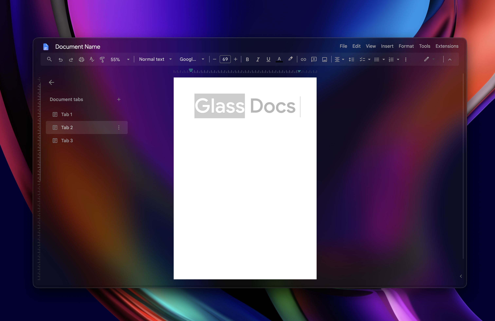

# Glass Docs - Zen Boost

Most Google Docs dark themes look broken because Docs isn't structured like a
regular website; it's a brittle, monolithic app designed to fight custom CSS.
Instead of brute-forcing styles with destructive CSS, or settling for a mediocre
theme, I made this stylesheet to bypass these constraints.

## Features

- Coherent glassmorphism look
- Compact header, full menu bar retained
- Annoying Gemini buttons stripped out
- Customisable colour accents (indent marker, tabs, etc)

## Installation

1. Enable **Boost** for Google Docs
2. Open the Code `{ }` editor and paste all of [`theme.css`](theme.css)

Recommended: for a darker look, install the
[Transparent Zen mod](https://zen-browser.app/mods/642854b5-88b4-4c40-b256-e035532109df/?q=transparent). It doesn't have to be
enabled on Google Docs; it removes the base canvas Gecko paints under every
page.

[NOTES.md](NOTES.md) covers tuning, what's hidden, and how the stylesheet gets
around Docs.

MIT
